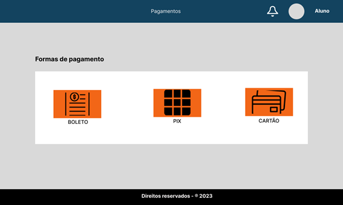
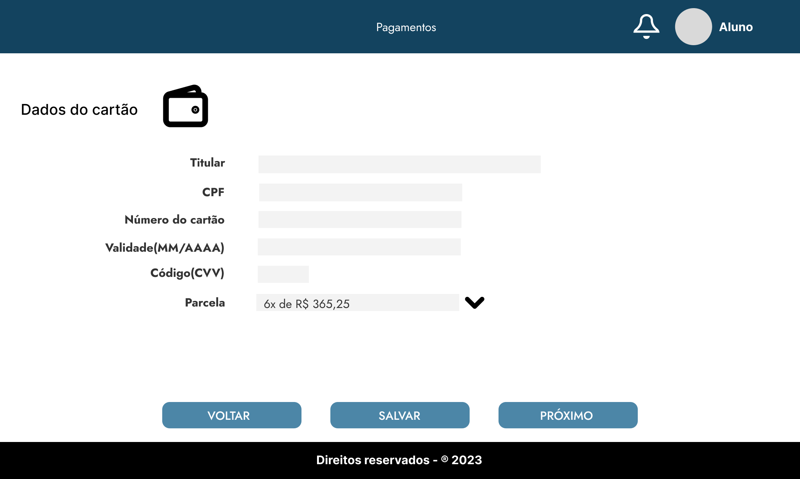
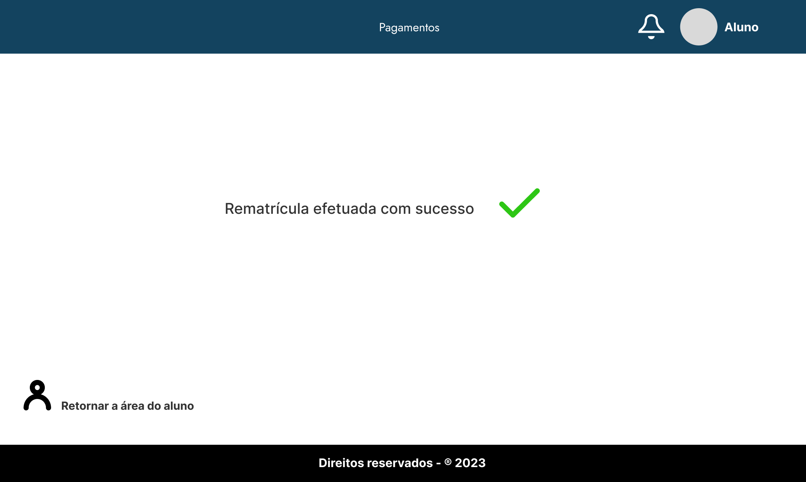

# segunda-entrega-projeto
Repositório referente a segunda entrega do projeto integrador - 2023

 

Abaixo temos a apresentação do protótipo visual do projeto integrador do terceiro trimestre da turma de ADS.

Foram adicionadas as principais telas descritas pelo diagrama de caso de uso da primeira entrega

    
Para começar a apresentação do protótipo visual do nosso projeto, nada melhor do que começar pela tela de Login.

    
A ideia é ter uma tela intuitiva e única para que os usuários possam se conectar e navegar pela aplicação.

    

    
A segunda tela é a tela Home, foca no aluno seu objetivo é destacar as matérias nas quais ele está estudando, e trazer alguns destaques do blog além de uma navegação rápida pelo menu superior

    

    
Ainda focado no aluno temos a tela de Notas, com seu nome diz o intuito e mostrar para o aluno qual sua nota nas avaliações que ele fez.

    

    
Também focado no aluno temos a tela da Área de prova, sua função é que o aluno consiga realizar as provas, consultar os resultados e caso tenha, ter acesso a notificações sobre a prova.

    

    
Agora a tela de Exercícios, tela onde o aluno fara os exercícios disponibilizado pelos professores, obterá os resultados e também terá notificações especificas para os exercícios.

    

    
Já focado nos professores, temos a tela de cadastro de notas, onde o professor terá acesso a todos os alunos cadastros na sua matéria e poderá definir a nota de cada um.

    

    
Temos também a tela de cadastro de fornecedor, onde uma pessoa da coordenação ficara responsável por cadastrar os fornecedores da instituição.

    

    
As páginas abaixo representam as áreas para rematricula, onde o aluno devidamente logado pode realizar o procedimento, abaixo a home.

    

    
Ao selecionar "continuar" em dados pessoais, observamos a tela para preenchimento dos dados do aluno.

    

    
Ao selecionar "continuar" em informações do curso, observamos a tela para seleção das disciplinas desejadas.

    

    
Ao selecionar "continuar" em formas de pagamento, observamos a tela para seleção da forma de pagamento desejada.

    

    
Ainda no contexto de rematrícula, abaixo observamos um exemplo da página de dados de pagamento, na modalidade "cartão de crédito".

    

    
Após a seleção da modalidade de pagamento e a aprovação do mesmo, obteremos a tela de "sucesso" indicando que o procedimento foi bem sucedido.

    

